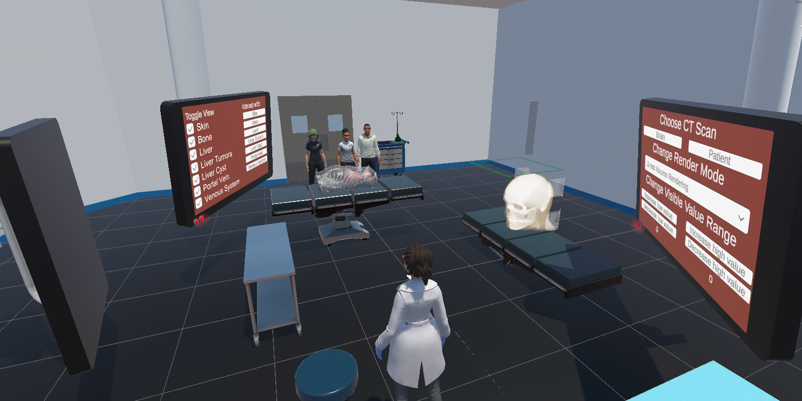
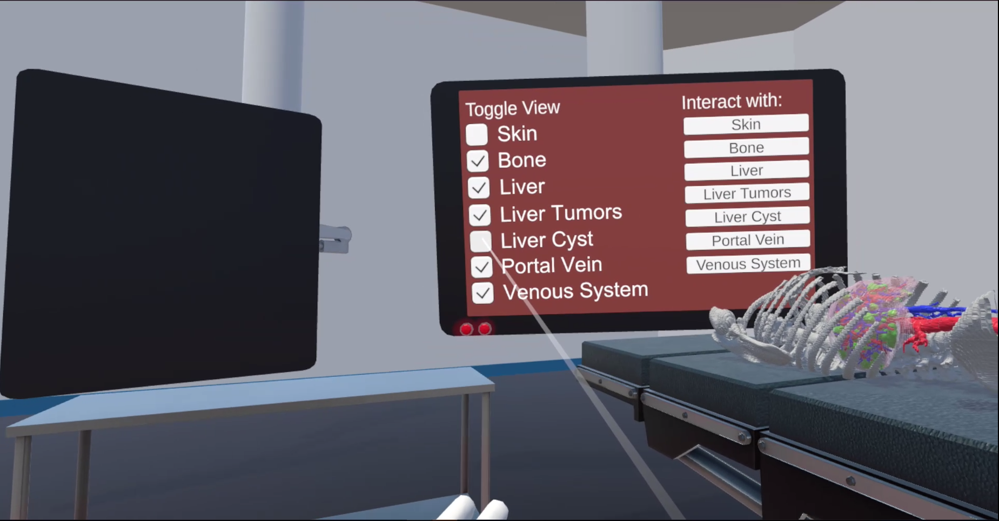
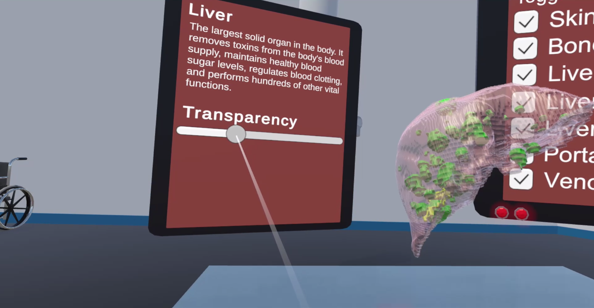
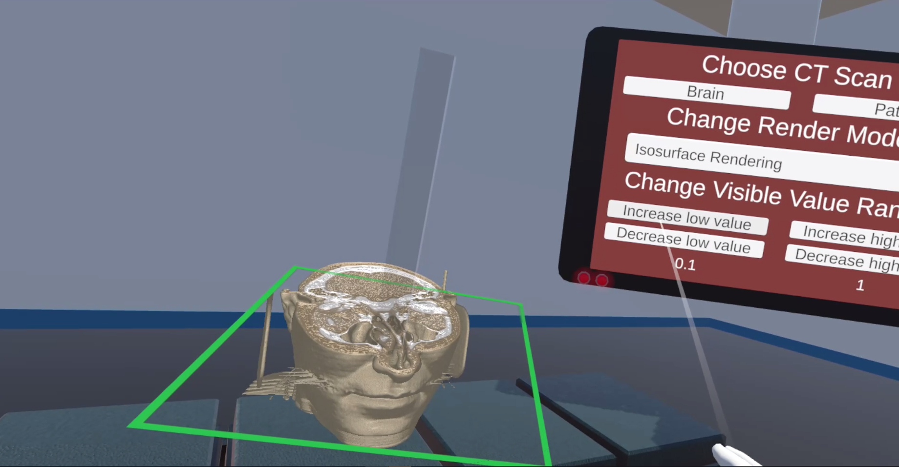
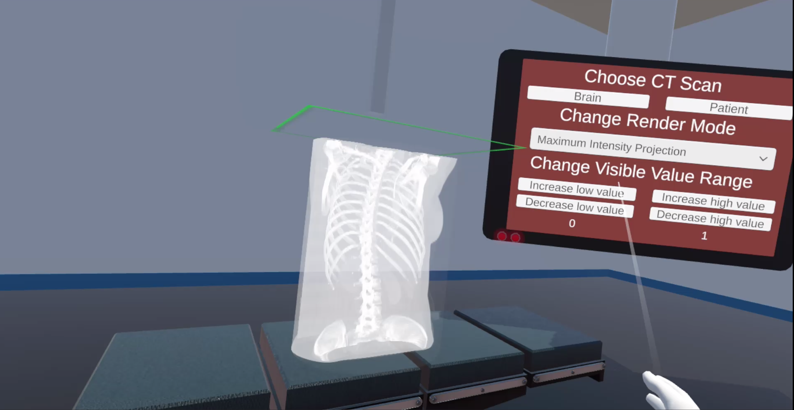
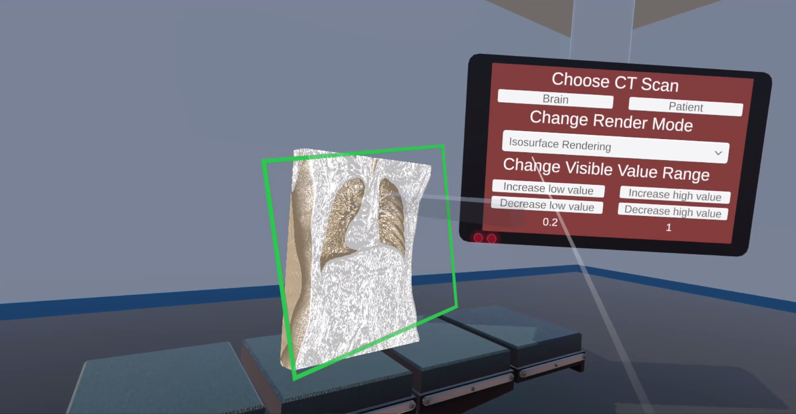

# Project for Hack-A-Roo Fall 2022

##  VR Hack-a-roo

## Team members:
1. Morgan Rogers
2. Saeed AlQarni
3. Ahmed Albishri

## Team Name: 
MedVR 

## Our Usecase: 
This VR project is geared toward the medical domain and is made with medical education in mind. This project contains segmented organs that are
interactive 3D objects. The user can toggle which organs they see, choose organs to interact with, read and listen to descriptions about the organs,
and change the transparency of the liver tissue to see cysts and tumors inside. This project also uses the [Unity Volume Rendering](https://github.com/mlavik1/UnityVolumeRendering) open source project to present CT scans in VR. 
The user can control a slicer that 'cuts' through the different slices that make up the CT scan, change the scan's render mode, and adjust the visible
value range for the scan.

